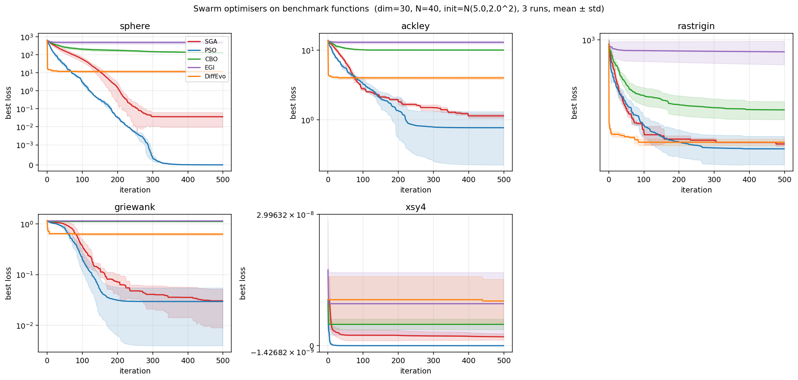

# Swarm Optimizers in PyTorch

This repository, specifically `swarm.py`, contains implementations of

1. **SwarmGradAccel (SGA)** — novel optimizer (described below)
2. Particle Swarm Optimization (PSO)
3. Consensus Based Optimization (CBO)
4. Diffusion Evolution
5. EGICBO

They are evaluated on the following tasks:

1. Benchmark optimisation functions (`bench.py`, `eval.py`)
2. MNIST digit classification (`mnist.py`)
3. Regression (`reg.py`)
4. Physics-informed neural networks (`burger.py`)
5. Language modelling (`gpt/gpt_train.py`)

## SwarmGradAccel (SGA)

SGA is a zeroth-order, particle-based optimiser. It estimates a descent direction at each particle from *pairwise* loss differences with randomly sampled reference particles, then applies an Adam-style moment update to that direction.

### Notation

Let $N$ be the number of particles, $f : \mathbb{R}^d \to \mathbb{R}$ the objective, and $X = (x_1, \ldots, x_N) \in \mathbb{R}^{N \times d}$ the swarm at iteration $t$. The hyperparameters are: the number of reference particles $K$, the leak slope $\alpha$ of the LeakyReLU, the normalisation exponent $p \in \{0, 1, 2\}$, learning rate $\eta$, momentum coefficients $\beta_1, \beta_2$, drift weight $c_1$, and noise scale $c_2$.

### Update rule

At each step $t$:

**1. Draw $K$ random reference assignments.** For each $k = 1, \ldots, K$, sample a permutation $\pi_k$ of $\{1, \ldots, N\}$ uniformly at random. Particle $i$'s $k$-th reference is $\pi_k(i)$.

**2. Compute the swarm-gradient surrogate.** For each particle $i$, accumulate the contribution of every reference,

$$
g_i \;=\; \frac{1}{K} \sum_{k=1}^{K} \, \phi_\alpha\!\bigl(f(x_i) - f(x_{\pi_k(i)})\bigr) \cdot \frac{x_{\pi_k(i)} - x_i}{\lVert x_{\pi_k(i)} - x_i \rVert^{p} + \varepsilon}
$$

where $\phi_\alpha$ is the LeakyReLU with negative slope $\alpha$:

$$
\phi_\alpha(z) \;=\; \begin{cases} z & z \ge 0 \\ \alpha z & z < 0 \end{cases}
$$

The intuition is: if the reference particle has a *lower* loss ($f(x_{\pi_k(i)}) < f(x_i)$, so $z>0$), $g_i$ points fully toward it; if it has a *higher* loss ($z<0$), $\phi_\alpha$ damps the term by $\alpha$, so we still move slightly toward it (information about the local geometry is not discarded entirely, just down-weighted). The denominator with exponent $p$ controls how distance is treated: $p=0$ = raw difference, $p=1$ = unit direction, $p=2$ = inverse-distance scaling.

**3. Adam-style moments.** Track first and second moments of $g$:

$$
m_t = \beta_1 m_{t-1} + (1-\beta_1)\, g, \qquad v_t = \beta_2 v_{t-1} + (1-\beta_2)\, g^{\odot 2}
$$

with bias correction $\hat{m}_t = m_t / (1-\beta_1^t)$ and $\hat{v}_t = v_t / (1-\beta_2^t)$.

**4. Particle update.** Add the bias-corrected, normalised step plus optional Gaussian exploration noise $\xi \sim \mathcal{N}(0, I)$:

$$
x_i \;\leftarrow\; x_i \;+\; \eta\, c_1 \cdot \frac{\hat{m}_t}{\sqrt{\hat{v}_t} + \varepsilon} \;+\; c_2 \, \xi
$$

The non-momentum variant simply uses $x_i \leftarrow x_i + c_1 g_i + c_2 \xi$.

### Notes

- $g_i$ is a finite-difference / "ensemble-gradient" surrogate, similar in spirit to evolution strategies but using *peer comparisons* rather than a fixed mean. Unlike CBO it has no global consensus point — directions are local to each particle.
- $K > 1$ averages over multiple reference particles per step, reducing variance of $g_i$ at the cost of more shuffles.
- The (optional) sub-swarm mode partitions particles into groups that only sample references within their group for the first 1000 steps, then merge.

## Benchmark results

`eval.py` runs all swarm optimisers on the standard benchmark functions (sphere, ackley, rastrigin, griewank, xsy4) and produces a comparison plot:

```bash
python3 eval.py --N 40 --dim 30 --iterations 500 --runs 3 --out benchmark.png
```

PSO uses the canonical Clerc-Kennedy constriction setting ($w = 0.7298$, $c_1 = c_2 = 1.49445$); CBO uses CBXpy-style defaults ($\lambda = 1$, $\sigma = \sqrt{2}$, $\Delta t = 0.1$, $\alpha = 100$).



## References

PSO:
```
@inproceedings{eberhart1995particle,
    title={Particle swarm optimization},
    author={Eberhart, Russell and Kennedy, James},
    booktitle={Proceedings of the IEEE international conference on neural networks},
    volume={4},
    pages={1942--1948},
    year={1995},
    organization={Citeseer}
}
```

CBO:
```
@article{pinnau2017consensus,
    title={A consensus-based model for global optimization and its mean-field limit},
    author={Pinnau, Ren{\'e} and Totzeck, Claudia and Tse, Oliver and Martin, Stephan},
    journal={Mathematical Models and Methods in Applied Sciences},
    volume={27},
    number={01},
    pages={183--204},
    year={2017},
    publisher={World Scientific}
}
```

EGICBO:
```
@article{schillings2023ensemble,
    title={Ensemble-based gradient inference for particle methods in optimization and sampling},
    author={Schillings, Claudia and Totzeck, Claudia and Wacker, Philipp},
    journal={SIAM/ASA Journal on Uncertainty Quantification},
    volume={11},
    number={3},
    pages={757--787},
    year={2023},
    publisher={SIAM}
}
```

Diffusion Evolution:
```
@article{zhang2024diffusion,
    title={Diffusion Models are Evolutionary Algorithms},
    author={Zhang, Yanbo and Hartl, Benedikt and Hazan, Hananel and Levin, Michael},
    journal={arXiv preprint arXiv:2410.02543},
    year={2024}
}
```
